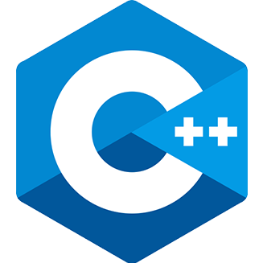
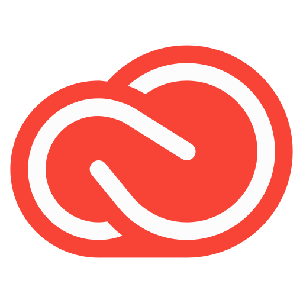

<!-- <h1 align="center">Hi there, I'm Nikesh(he/him) 👋</h1>  -->

I'm mostly fond of working on problems that involve designing and development. I also love exploring new technologies/projects. Feel free to message me about projects and if you like my projects then consider ⭐starring⭐ them

<!-- 

<!--  -->

<h2 align="center">Languages & Tools💻</h2>

---

<!-- Oh boy I sure didn't think how it'd look on phone -->

<!--
**nikeplusdash/nikeplusdash** is a ✨ _special_ ✨ repository because its `README.md` (this file) appears on your GitHub profile.

Here are some ideas to get you started:

- 🔭 I’m currently working on ...
- 🌱 I’m currently learning ...
- 👯 I’m looking to collaborate on ...
- 🤔 I’m looking for help with ...
- 💬 Ask me about ...
- 📫 How to reach me: ...
- 😄 Pronouns: ...
- ⚡ Fun fact: ...
-->
